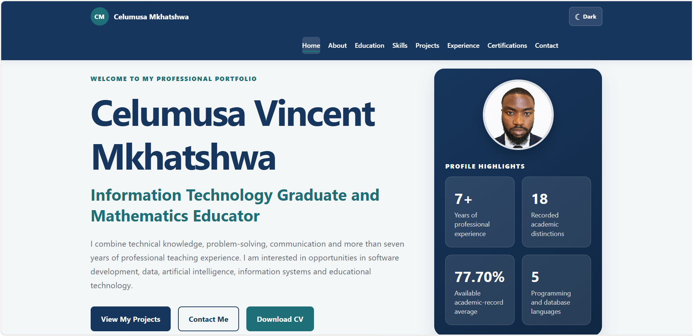

# Celumusa Vincent Mkhatshwa – Virtual CV

A responsive professional portfolio website presenting my education, technical skills, academic projects, professional experience, certifications and contact information.

## Live Website

[View the live Virtual CV](https://ccv254.github.io/virtual-cv/)

## Website Preview



## About the Project

This Virtual CV was developed as a professional online portfolio to complement my traditional CV, GitHub profile and LinkedIn profile.

The website presents my combined background as an Information Technology graduate and experienced Mathematics educator. It highlights my technical capabilities, academic achievements, professional experience, projects and career interests.

## Main Features

- Responsive desktop, tablet and mobile design
- Professional light and dark themes
- Saved theme preference
- Mobile navigation menu
- Active navigation highlighting
- Smooth section navigation
- Professional profile photograph
- Downloadable PDF CV
- Back-to-top button
- GitHub and LinkedIn profile links
- Accessible keyboard navigation
- Reduced-motion accessibility support
- Responsive project, skills and education cards

## Technologies Used

- HTML5
- CSS3
- JavaScript
- Git
- GitHub
- GitHub Desktop
- Visual Studio Code
- GitHub Pages

## Website Sections

The Virtual CV contains the following sections:

1. Home
2. About Me
3. Education
4. Skills
5. Selected Projects
6. Professional Experience
7. Certifications
8. Contact Information

## Featured Project

### Professional Virtual CV

The website itself demonstrates:

- Semantic HTML structure
- Responsive CSS Grid and Flexbox layouts
- CSS custom properties
- Light and dark themes
- JavaScript event handling
- Local storage
- Mobile navigation
- Active-section tracking
- Accessible controls
- GitHub Pages deployment

## Project Structure

```text
virtual-cv/
│
├── css/
│   └── style.css
│
├── documents/
│   └── Celumusa_Vincent_Mkhatshwa_CV.pdf
│
├── images/
│   ├── celumusa-profile-photo.png
│   ├── favicon.ico
│   └── virtual-cv-preview.png
│
├── js/
│   └── script.js
│
├── index.html
└── README.md
```

## Running the Website Locally

1. Download or clone the repository.
2. Open the `virtual-cv` project folder.
3. Open `index.html` in a web browser.

Alternatively, clone the repository using Git:

```bash
git clone https://github.com/CCV254/virtual-cv.git
```

Then open `index.html` inside the downloaded `virtual-cv` folder.

## Responsive Design

The website was tested on:

- Desktop screens
- Tablet-sized screens
- Mobile-phone screens
- Microsoft Edge
- Google Chrome

The layout adjusts automatically to different screen sizes using CSS media queries.

## Accessibility

Accessibility features include:

- Semantic HTML elements
- Descriptive alternative text
- Keyboard-visible focus indicators
- Skip-to-content link
- Accessible mobile-menu and theme controls
- ARIA labels and states
- Reduced-motion support
- Sufficient colour contrast
- Responsive text and controls

## Professional Profiles

- [GitHub Profile](https://github.com/CCV254)
- [LinkedIn Profile](https://www.linkedin.com/in/celumusa-mkhatshwa-08054617b/)
- [Live Virtual CV](https://ccv254.github.io/virtual-cv/)

## Contact

**Celumusa Vincent Mkhatshwa**

Johannesburg, South Africa

Email: [celumusa99@gmail.com](mailto:celumusa99@gmail.com)

## Author

Developed by **Celumusa Vincent Mkhatshwa**, an Information Technology graduate and experienced Mathematics educator interested in software development, data, artificial intelligence, information systems and educational technology.